```{r setup, include=FALSE}
suppressPackageStartupMessages({
    require(BiocStyle)
})
```

# iSEE: Interactive visualization of `SummarizedExperiment` objects

Authors:
    Kevin Rue-Albrecht^[Kennedy Institute of Rheumatology, University of Oxford,
    Headington, Oxford OX3 7FY, UK.],
    Charlotte Soneson^[Friedrich Miescher Institute for Biomedical Research and SIB Swiss Institute of Bioinformatics],
    Federico Marini^[Center for Thrombosis and Hemostasis Mainz (CTH) and Institute of Medical Biostatistics, Epidemiology and Informatics (IMBEI), University Medical Center of the Johannes Gutenberg University Mainz],
    Aaron TL Lun^[Another Institution].
    <br/>
Last modified: 4 April, 2019.

## Overview

### Description

This workshop demonstrates how to use the `r Biocpkg("iSEE")` package to create
and configure interactive applications for the exploration of various types of
genomics data sets (e.g., bulk and single-cell RNA-seq, CyTOF, gene expression
microarray).

This workshop will be presented as a lab session that combines an instructor-led
live demo, followed by hands-on experimentation guided by completely worked
examples and stand-alone notes that participants may continue to use after the
workshop.

The instructor-led live demo comprises three parts:

1. Brief lecture on the package concept and functionality
2. Overview of the graphical user interface
3. Instructions to preconfigure `r Biocpkg("iSEE")` apps

The hands-on lab comprises three part:

1. Inspection of single-cell RNA-seq data at various steps of a typical
computational workflow, including quality control and dimensionality reduction
2. Addition of custom panels to the user interface for advanced visualization.
3. Additional questions from the participants, including individual use cases
and suggestions for future developments

Participants are encouraged to ask questions at any time during the workshop.

### Pre-requisites

* Basic knowledge of [_R_](https://www.r-project.org/about.html) syntax and the
use of data-frames
* Familiarity with the `r Biocpkg("SummarizedExperiment")` and 
`r Biocpkg("SingleCellExperiment")` classes
* Familiarity with the `r CRANpkg("shiny")` CRAN package
* Familiarity with the `r Biocpkg("TENxPBMCData")` package and vignette

Additional background reading about the programming environment, relevant
packages, and example use cases:

* Shiny from RStudio: https://shiny.rstudio.com
* SummarizedExperiment paper: https://www.nature.com/articles/nmeth.3252 (Figure 2)
* iSEE paper: https://f1000research.com/articles/7-741/v1

### Participation

Students will participate by following along an 
[_R markdown_](https://rmarkdown.rstudio.com/) document, and asking questions 
throughout the workshop.
There is also scope for participants to apply `r Biocpkg("iSEE")` to their own 
data sets, and fuel the discussion with more questions about specific use cases.

### _R_ / _Bioconductor_ packages used

1. _iSEE_ : https://bioconductor.org/packages/iSEE
2. _SummarizedExperiment_: https://bioconductor.org/packages/SummarizedExperiment
3. _SingleCellExperiment_: https://bioconductor.org/packages/SingleCellExperiment
4. _scater_: https://bioconductor.org/packages/scater
5. _scran_: https://bioconductor.org/packages/scran
6. _TENxPBMCData_: https://bioconductor.org/packages/TENxPBMCData

### Time outline

| Activity                                      | Time |
|-----------------------------------------------|------|
| **Lecture**: Overview of package and concepts | 15m  |
| **Live demo**: the user interface             | 15m  |
| **Lab**: Configuring the app interface        | 20m  |
| **Lab**: A single-cell RNA-seq workflow       | 20m  |
| **Lab**: Custom panels                        | 20m  |
| Additional questions                          | 15m  |

**Total:** 1h45

### Workshop goals and objectives

#### Learning goals

* Recognize the benefits of integrative data containers such as 
[`SummarizedExperiment`](http://bioconductor.org/packages/SummarizedExperiment) 
and [`SingleCellExperiment`](http://bioconductor.org/packages/SingleCellExperiment) 
for downstream analyses and visualization
* Outline the unique features of [_iSEE_](http://bioconductor.org/packages/iSEE/) 
built upon the [RStudio Shiny](https://shiny.rstudio.com) framework
* Identify biological data that may be combined into insightful graphical outputs
* Utilize interactive GUI components and layouts to efficiently extract
information from biological data sets
* Describe how to construct interactive apps and custom panels

#### Learning objectives

* Memorize the key information available in [`SummarizedExperiment`](http://bioconductor.org/packages/SummarizedExperiment) 
and [`SingleCellExperiment`](http://bioconductor.org/packages/SingleCellExperiment) 
objects
* Set up a local environment for running 
[_iSEE_](https://bioconductor.org/packages/iSEE) apps
* Interact with components of the [_iSEE_](https://bioconductor.org/packages/iSEE) 
user interface to visually inspect and discuss various data sets
* Identify and locate configurable aspects of 
[_iSEE_](https://bioconductor.org/packages/iSEE) apps
* Practice interactive visualization over a single-cell RNA-sequencing workflow
* Design custom [_iSEE_](https://bioconductor.org/packages/iSEE) panels for 
advanced use cases
* Imagine use cases and future developments for interactive visualization as 
part of computational workflows

## Workshop

### Preparation of example scRNAseq data

In this workshop, we will use example data from the `r Biocpkg("TENxPBMCData")`
package.

```{r, message=FALSE}
library(TENxPBMCData)
```

The man page for the `TENxPBMCData()` function gives an idea of the datasets
that are available from this package.

```{r, eval=FALSE}
help(TENxPBMCData)
```

We will use the `"pbmc3k"` dataset, which contains gene expression profiles for
2,700 single peripheral blood mononuclear cells, profiled using the 10x Genomics
technology. The first time this dataset is loaded, this command will download
the dataset to a local cache, which takes some time, depending on the speed of
your internet connection. Subsequent times, this will load the dataset directly
from the local cache.

```{r, message=FALSE, warning=FALSE}
sce <- TENxPBMCData(dataset = "pbmc3k")
```

At this point we can inspect the dataset.

```{r}
sce
```

The dataset is provided as an object of the `SingleCellExperiment` class. In
particular, this summary view indicates that the following pieces of information
are available:

- An assay matrix named `"counts"`
- Row names (i.e. genes) are Ensembl gene identifiers
- Row metadata include the official gene symbol, and the gene symbol used by the
10x CellRanger quantification pipeline
- Column names (i.e., cells) are not initialized and left to `NULL`
- Column metadata include, among others, the cell barcode (`"Barcode"`) and the
donor identifier (`"Individual"`).

A `SingleCellExperiment` (or, more in general, any `SummarizedExperiment`)
object like this already contains sufficient information to launch an `iSEE`
instance and visualize the available data and metadata.

<!-- Do we want to open iSEE already here? If so, we should probably go through the panels etc already at this stage, otherwise it may become a bit confusing -->

```{r, message=FALSE}
library(iSEE)
if (interactive()) {
    iSEE(sce)
}
```

Note that the `iSEE()` function automatically detects the types of information
available in the `sce` object, and enables only panels for which the relevant
data is available.

Next, we will apply some preprocessing to the `SingleCellExperiment` object, in
order to populate it with more information that can be visualized with `iSEE`.
The steps below roughly follow those outlined in the `simpleSingleCell`
[Bioconductor workflow](https://bioconductor.org/packages/simpleSingleCell/).

We will start by adding column names to the object, and use gene symbols instead
of Ensembl IDs as row names. In the case where multiple Ensembl IDs correspond
to the same gene symbol, the `scater::uniquifyFeatureNames` function will
concatenate the Ensembl ID and the gene symbol in order to generate unique
feature names.

```{r}
colnames(sce) <- paste0("Cell", seq_len(ncol(sce)))
rownames(sce) <- scater::uniquifyFeatureNames(rowData(sce)$ENSEMBL_ID, 
                                              rowData(sce)$Symbol_TENx)
sce
```

Next, we use the `r Biocpkg("scater")` package to calculate gene- and cell-level
quality metrics. These metrics will be added as columns to the `rowData` and
`colData` slots of the `SingleCellExperiment` object, respectively.

```{r, message = FALSE}
library(scater)
MT <- rownames(sce)[grep("^MT-", rownames(sce))]
sce <- scater::calculateQCMetrics(sce, 
                                  feature_controls = list(MT = MT))
sce
```

We filter out a few cells with a large fraction of the counts coming from
mitochondrial genes, since these may be damaged cells.

```{r}
(sce <- sce[, sce$pct_counts_MT < 5])
```

Next, we calculate size factors and normalized and log-transformed expression
values, using the `r Biocpkg("scran")` and `r Biocpkg("scater")` packages.

```{r, message = FALSE}
library(scran)
library(BiocSingular)
sce <- scran::computeSumFactors(sce, min.mean = 0.1)
summary(sizeFactors(sce))
sce <- scater::normalize(sce)
```

In order to extract the most informative genes, we first model the mean-variance
trend and decompose the variance into biological and technical components.

```{r}
logcounts(sce) <- as.matrix(logcounts(sce))
new.trend <- scran::makeTechTrend(x = sce)
fit <- scran::trendVar(sce, use.spikes = FALSE, loess.args = list(span = 0.05))
fit$trend <- new.trend
dec <- scran::decomposeVar(fit = fit)
top.dec <- dec[order(dec$bio, decreasing = TRUE), ] 
head(top.dec)
```

Next, we apply principal components analysis (PCA) and t-distributed stochastic
neighbor embedding (t-SNE) to generate low-dimensional representations of the
cells in our data set. These low-dimensional representations will be added to
the `reducedDim` slot of the `SingleCellExperiment` object.

```{r}
set.seed(1000)
sce <- scran::denoisePCA(sce, technical = new.trend, BSPARAM = IrlbaParam())
ncol(reducedDim(sce, "PCA"))
set.seed(1000)
sce <- scater::runTSNE(sce, use_dimred = "PCA", perplexity = 30)
sce
```

Finally, we cluster the cells using a graph-based algorithm, and find 'marker
genes' for each cluster as the genes that are significantly upregulated in the
cluster compared to each of the other inferred clusters. The adjusted p-values
from this test, for each cluster, are added to the `rowData` slot of the object.

```{r}
snn.gr <- scran::buildSNNGraph(sce, use.dimred = "PCA")
clusters <- igraph::cluster_walktrap(snn.gr)
sce$Cluster <- factor(clusters$membership)
table(sce$Cluster)

markers <- scran::findMarkers(sce, clusters = sce$Cluster, 
                              direction = "up", pval.type = "all")
for (i in names(markers)) {
    rowData(sce)[, paste0("FDR_cluster", i)] <- 
        markers[[i]]$FDR[match(rownames(sce), 
                               rownames(markers[[i]]))]
}
sce
```

This concludes the preparation of the data. Now we have a `SingleCellExperiment`
object containing different types of abundance values, reduced dimension
representations as well as a range of row (feature) and column (cell) metadata.
We can launch an `iSEE` instance for exploring this data set using the `iSEE()`
function:

```{r, message=FALSE}
library(iSEE)
if (interactive()) {
    iSEE(sce)
}
```

The main argument to `iSEE()` is a `SummarizedExperiment` object, or an object
of any class extending `SummarizedExperiment` (such as `SingleCellExperiment`,
as used here). No other restrictions are made on the type of data stored in the
object, and `iSEE` can be used for interactive visualization of many different
types of data. It is also worth noting that for various types of data,
Bioconductor packages provides functionality for directly importing
quantifications generated by external software packages into a
`SummarizedExperiment` object. For example, the `r Biocpkg("DropletUtils")`
package can read quantifications from the 10x Genomics CellRanger pipeline for
single-cell RNA-seq data, and the `r Biocpkg("tximeta")` package can be used to
read data from transcript quantification pipelines into a `SummarizedExperiment`
object.

### Overview of the _iSEE_ package
<!-- Talk a bit about the usefulness of visualization. -->
This section provides an overview of the graphical interface of `iSEE`
applications. To follow along, make sure that you have launched an `iSEE`
instance as described in the code block at the end of the previous section.

Note that for simplicity, we will typically refer to a `SummarizedExperiment`
below; however, `iSEE` will work seamlessly for objects of any class extending
`SummarizedExperiment` as well (e.g., `SingleCellExperiment`, `DESeqDataSet`).
In addition, some panels, such as the `Reduced dimension plot`, are only
available for objects that contain a `reducedDim` slot (in particular,
`SingleCellExperiment` objects); the basic `SummarizedExperiment` class does not
contain this slot. We will refer to the rows of the `SummarizedExperiment`
object as 'features' (these can be genes, transcripts, regions, etc) and to the
columns as 'samples' (which, in our example data set, are single cells).

### The user interface
The `iSEE` user interface consists of a numbr of panels, each displaying the
data provided in the `SummarizedExperiment` from a specific perspective. There
are eight standard panel types; six plot panels and two table panels, as shown
in the figure below. By default, one panel of each type is included. However,
the user is free to rearrange, resize, remove or add panels freely, as will be
described in a later section. Below, we provide a brief overview of each panel
type. In addition to these types, the user can create custom panels (both plots
and tables), which will be discussed later in the workshop.

<!-- This is perhaps not very pedagogical - the app will not look like the one below if it is just opened with the object created above. But it's nice to show the capabilities of the panels too, not just the default settings --> 

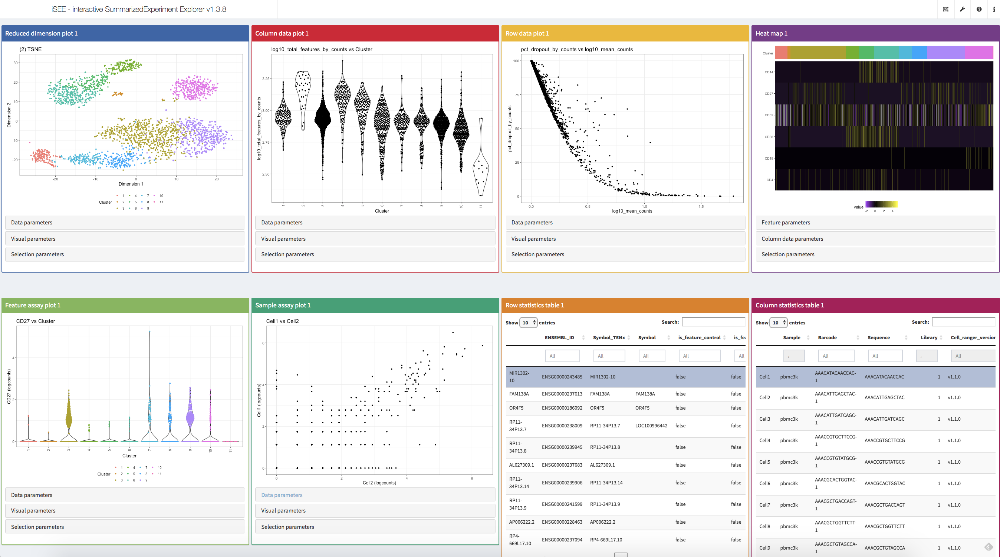

#### Reduced dimension plot
The reduced dimension plot can display any reduced dimension representation that
is present in the `reducedDim` slot of the `SingleCellExperiment` object. Note
that this slot is not defined for the base `SummarizedExperiment` class.
 
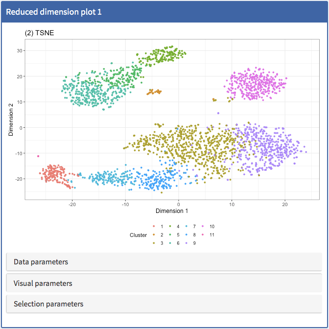

#### Column data plot
The column data plot displays one or two of the provided column annotations
(from the `colData` slot). Depending on the class of the selected annotations,
the panel will show either a Hinton diagram [@Hinton1991-hintondiagram; @Bremner1994-hintonplots], a
violin plot or a scatter plot.

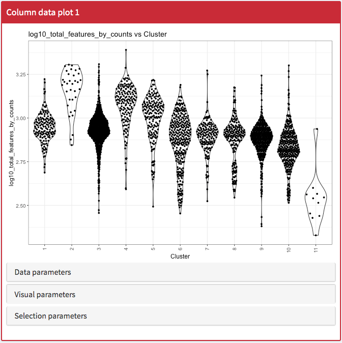

#### Row data plot
Analogous to the column data plot, the row data plot displays one or two of the
provided row annotations (from the `rowData` slot). Depending on the class of
the selected annotations, the panel will show either a Hinton plot, a violin
plot or a scatter plot.

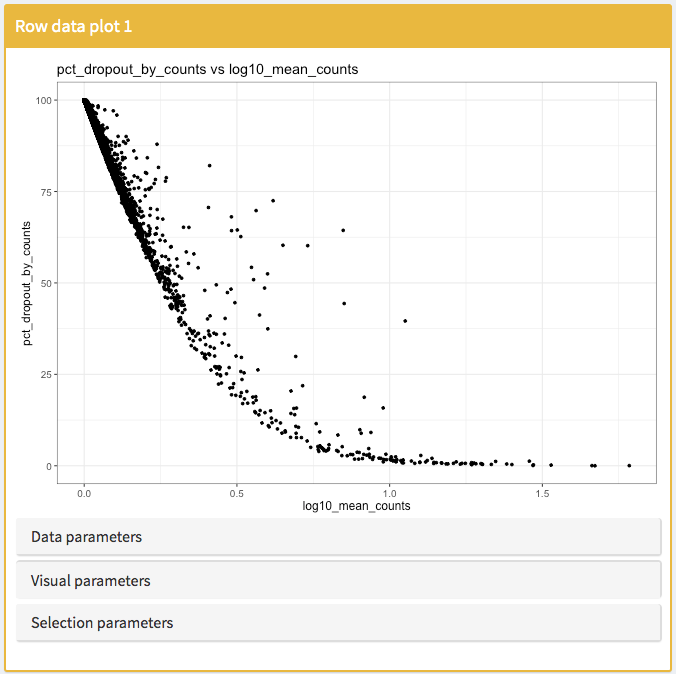

#### Heatmap
The heatmap shows the observed values for a subset of the features across the
samples.

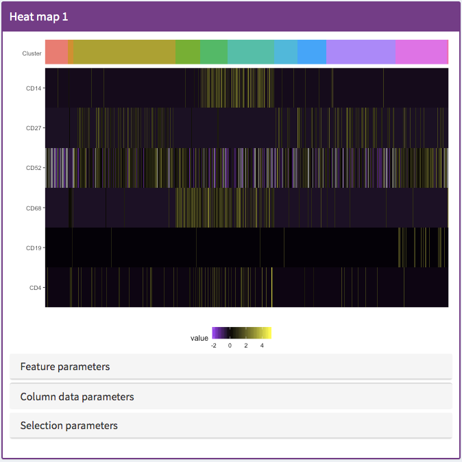

#### Feature assay plot
The feature assay plot displays the observed values for one feature across the
samples.It is also possible to plot the observed values for two features, in a
scatter plot.

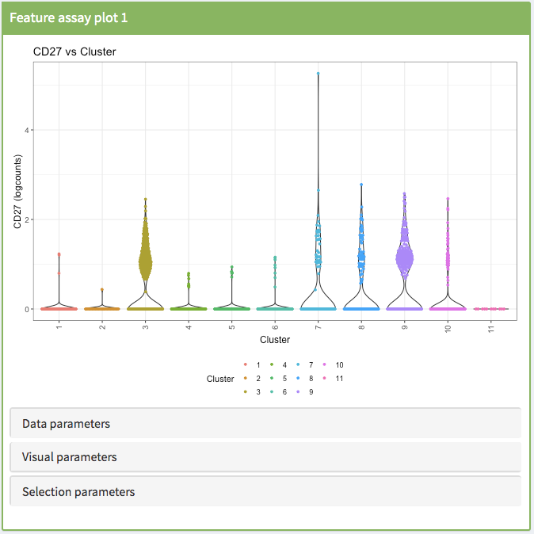

#### Sample assay plot
Analogous to the feature assay plot, the sample assay plot shows the observed
values for all features, for one of the samples. It is also possible to plot the
observed values for two samples, in a scatter plot.

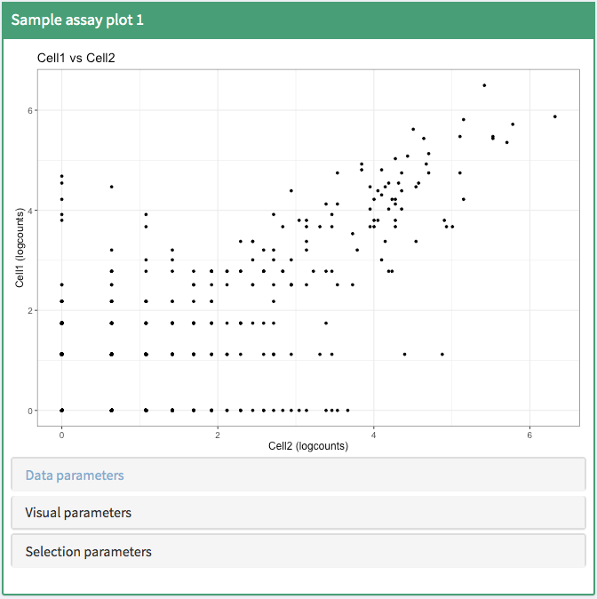

#### Row statistics table
The row statistics table displays all information provided in the `rowData` slot
of the `SummarizedExperiment` object.

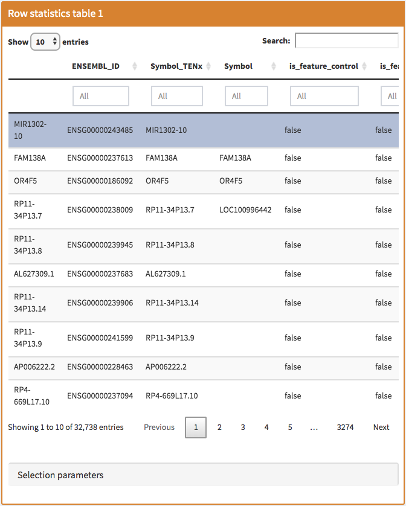

#### Column statistics table
The column statistics table displays all information provided in the `colData`
slot of the `SummarizedExperiment` object.

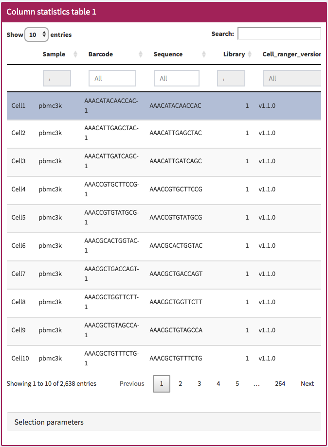

#### 'Data parameters' collapsible box
Each plot panel type has a `Data parameters` collapsible box. This box will have
somewhat different content for the different panel types, but in all cases lets
the user control what is displayed in the plot.

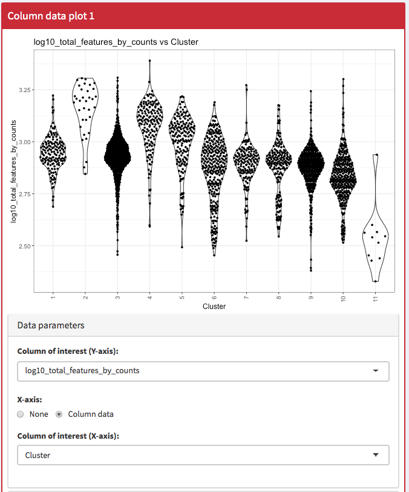

#### 'Visual parameters' collapsible box
While the `Data parameters` collapsible box lets us control _what_ is displayed
in the plot, the `Visual parameters` box lets us control _how_ it is displayed.
Here, we can change the size, shape, opacity and color of the points, facet the
plot by any provided categorical annotation, subsample points for increased
speed of plot rendering and control how legends are displayed.

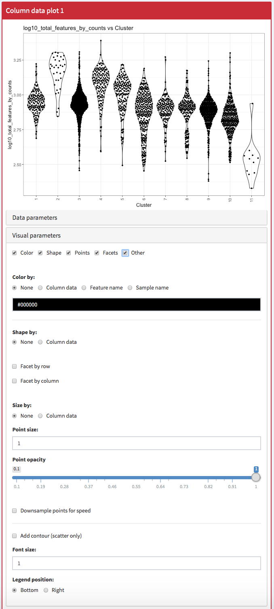

#### 'Selection parameters' collapsible box
Using the controls in the `Selection parameters` collapsible box, we can
transfer selections of points (features or samples) between panels. We will
discuss point transmission in more detail later in the workshop.

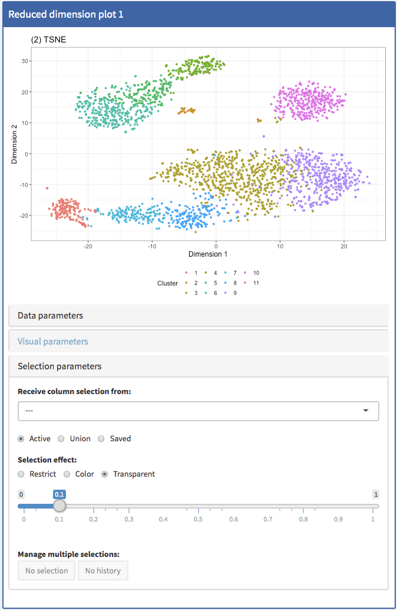

#### Additional controls
The top-right corner of the iSEE application provides additional controls for
reproducibility, configuration and help. Each of these will be discussed in more
detail later in the workflow.

- Panel organization: 

- Diagnostics:
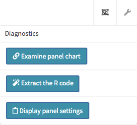
- Documentation:

- Additional info:
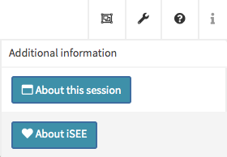

<!-- Show how to change what is plotted, faceting, changing appearance/color -->
<!-- Transmit selections -->
<!-- Subsampling --> 

### Configuration of the app interface
As mentioned above, by default an `iSEE` instance displays one panel of each of
the standard types. However, in some cases we want to have multiple panels of
the same type, and/or exclude some panel types. In order to accommodate such
situations, the uesr can add, remove, change the order of and resize all panels
via the `Panel organization` menu in the top-right corner. Using your open
`iSEE` instance, click on this menu and try to add and remove panels, and resize
the existing ones. Note that the total width of a row in the interface is 12
units, and when the total width of the panels in a row exceeds 12, the last of
them will be moved to a new row.

Once a suitable panel configuration has be achieved, we want to be able to start
the application in this configuration, to avoid the need to manually organize
the panels each time the app is opened. This can be achieved by exporting the
current panel settings. To do this, click on the wrench icon in the top-right
corner, and select 'Display panel settings'. Scroll to the end of the code in
the popup window and copy the definition of the `initialPanels` variable. For
example:

```{r}
initialPanels <- DataFrame(
    Name=c("Reduced dimension plot 1", "Column data plot 1", 
           "Row data plot 1", "Heat map 1", 
           "Feature assay plot 1", "Sample assay plot 1", 
           "Row statistics table 1", "Column statistics table 1"
        ),
    Width=c(3L, 3L, 3L, 3L, 3L, 3L, 3L, 3L),
    Height=c(460L, 460L, 460L, 460L, 460L, 460L, 460L, 460L)
)
```

Next, close the application, run the code that you just copied in your R
session, and relaunch the application, now with the additional argument
`initialPanels` set:

```{r}
if (interactive()) {
    iSEE(sce, initialPanels = initialPanels)
}
```

Notice how the panel configuration at startup is now identical to the one you
saw when you displayed the panel settings.

<!-- Here we could mention the cytometry data, maybe also the 'gating' mode -->
<!-- Also related to sharing and communication: show how to save the configuration of panels, for next run (with quick startup) or for deployment -->

### Custom panels
<!-- Here we could mention the custom coverage plot, and link to bulk RNA-seq data -->
<!-- Multiple selections -> DE -->
<!-- If time is enough: Kev's comparison of reduced dimensionality could be also nice - just to show, maybe, and then link to the iSEE_custom repo -->

### Reproducibility
<!-- Code export -->
<!-- Config export! -->

### Sharing and communication
<!-- Tours -->
<!-- If there is enough time: draft a mini tour live (challenging: anchors might be tricky - rewarding: once it works, it is surely a OOOH thing) -->

### Resources
* Bioconductor landing page: [https://bioconductor.org/packages/iSEE/](https://bioconductor.org/packages/iSEE/)
* Publication (F1000Research, 2018): [https://f1000research.com/articles/7-741/v1](https://f1000research.com/articles/7-741/v1)
* Deployed examples: [https://marionilab.cruk.cam.ac.uk/](https://marionilab.cruk.cam.ac.uk/), code at [https://github.com/ltla/isee2018](https://github.com/ltla/isee2018)
  * Further deployments in the [https://github.com/federicomarini/iSEE_instances](https://github.com/federicomarini/iSEE_instances) repo
  * `iSEE` in production: [http://www.teichlab.org/singlecell-treg](http://www.teichlab.org/singlecell-treg)
* Custom panel examples: [https://github.com/kevinrue/iSEE_custom](https://github.com/kevinrue/iSEE_custom)
* Development version (bug reports etc): [https://github.com/csoneson/isee](https://github.com/csoneson/isee)

## Session info {-}

```{r}
sessionInfo()
```
